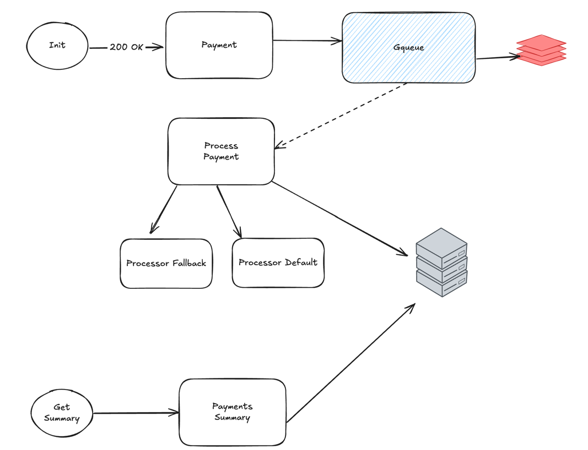
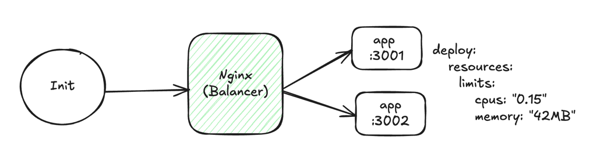

# Rinha de Backend 2025 - Payment Processing System

A high-performance, event-driven payment processing system built in Go for the Rinha de Backend 2025 competition. This system handles payment transactions using asynchronous messaging with fallback processors and real-time monitoring.

## 🏗️ Architecture

The system follows an event-driven microservices architecture with the following components:

- **Payment API**: REST API for payment operations and summaries
- **Event-Driven Processing**: Asynchronous payment processing using GQueue
- **Multiple Payment Processors**: Default and fallback payment processors
- **Caching Layer**: Redis for performance optimization
- **Load Balancing**: Nginx for distributing requests across multiple app instances
- **Monitoring**: Health checks and payment status tracking




## 🚀 Features

- **High-Performance Payment Processing**: Handles concurrent payment requests
- **Event-Driven Architecture**: Asynchronous processing with message queues
- **Fault Tolerance**: Fallback payment processors and retry mechanisms
- **Real-time Monitoring**: Payment status tracking and health checks
- **Scalable Design**: Multiple app instances with load balancing
- **Resource Efficient**: Optimized for low memory and CPU usage

## 📚 Documentation

- [Payment Event Flow](./docs/writer-payment.md) - Detailed explanation of the payment processing workflow
- [Docker Setup Guide](./README.Docker.md) - Instructions for building and deploying with Docker

## 🚀 Quick Start

### Prerequisites

- Docker and Docker Compose
- Go 1.23.7+ (for local development)

### Running with Docker

1. Clone the repository:
```bash
git clone https://github.com/IsaacDSC/rinhabackend2025.git
cd rinhabackend2025
```

2. Start the complete stack:
```bash
docker compose up --build
```

3. The application will be available at:
   - Main API: `http://localhost:3333`
   - App Instance 1: `http://localhost:3001`
   - App Instance 2: `http://localhost:3002`

### Local Development

1. Install dependencies:
```bash
go mod download
```

2. Set up environment variables:
```bash
export REDIS_URL=localhost:6379
export DATABASE_URL=user:password@tcp(localhost:3306)/rinhabackend
export GQUEUE_URL=http://localhost:8080
export PROCESSOR_DEFAULT_URL=http://localhost:8080
export PROCESSOR_FALLBACK_URL=http://localhost:8081
```

3. Run the application:
```bash
go run cmd/main.go
```
## 🔧 Configuration

The system uses environment variables for configuration:

- `APP_PORT`: Application port (default: 3333)
- `REDIS_URL`: Redis connection string
- `DATABASE_URL`: MySQL connection string
- `GQUEUE_URL`: GQueue service URL
- `PROCESSOR_DEFAULT_URL`: Primary payment processor URL
- `PROCESSOR_FALLBACK_URL`: Fallback payment processor URL

## 📄 License

See [LICENSE](./LICENSE) file for details.
