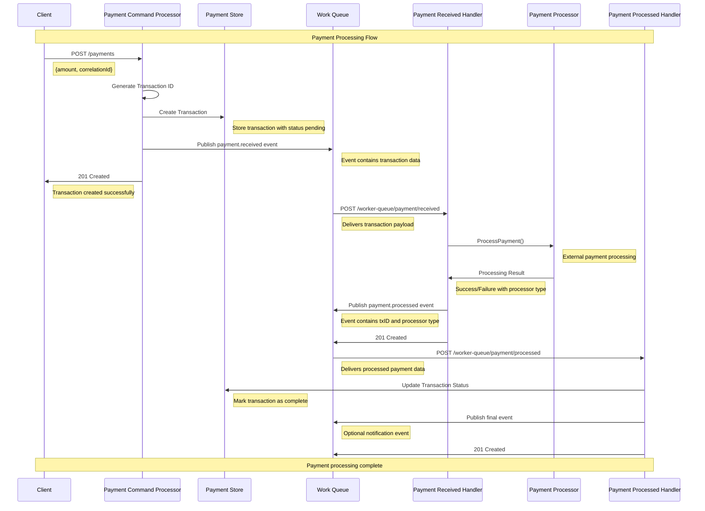

# Payment Processing Event Flow

This document describes the sequence of events in the payment processing system using a sequence diagram.

## Overview

The payment system follows an event-driven architecture with three main components:
- **Payment Command Processor**: Handles initial payment requests
- **Payment Received Event Handler**: Processes the payment through external processors
- **Payment Processed Event Handler**: Updates the final transaction status

## GQueue Asynchronous Messaging Configuration

The system uses GQueue for asynchronous message processing with the following configuration:

### Environment Configuration
```json
{
  "dev": {
    "host": "http://localhost:8080",
    "service_host": "http://localhost:3333", 
    "service_name": "rinhabackend2025",
    "repo_url": "https://github.com/example/user-service",
    "team_owner": "internal"
  }
}
```

### Event Consumers

#### 1. Payment Received Consumer (`payment.received`)
- **Queue Type**: `external.medium`
- **Endpoint**: `POST /worker-queue/payment/received`
- **Max Retries**: 3
- **Retention**: 168 hours (7 days)
- **Unique TTL**: 60 seconds
- **Type**: Persistent

#### 2. Payment Processed Consumer (`payment.processed`)  
- **Queue Type**: `external.medium`
- **Endpoint**: `POST /worker-queue/payment/processed`
- **Max Retries**: 3
- **Retention**: 168 hours (7 days)
- **Unique TTL**: 60 seconds
- **Type**: Persistent

### Queue Features
- **Persistence**: Messages are stored durably and survive service restarts
- **Retry Logic**: Failed messages are retried up to 3 times with exponential backoff
- **Message Retention**: Messages are kept for 7 days for debugging and recovery
- **Deduplication**: Unique TTL prevents duplicate message processing within 60 seconds
- **Medium Priority**: Uses balanced throughput and reliability settings

## Sequence Diagram



## Event Flow Description

### 1. Payment Command Processing
- **Trigger**: Client submits payment request
- **Action**: Creates transaction record and publishes `payment.received` event
- **Data**: Transaction with ID, correlation ID, amount, and timestamp

### 2. Payment Received Event
- **Trigger**: `payment.received` event from queue
- **Action**: Processes payment through external processor and publishes `payment.processed` event
- **Data**: Payment processing result with transaction ID and processor type

### 3. Payment Processed Event
- **Trigger**: `payment.processed` event from queue
- **Action**: Updates transaction status in database and optionally publishes final notification
- **Data**: Final transaction status and completion details

## Event Types

| Event | Description | Payload |
|-------|-------------|---------|
| `payment.received` | Initial payment request received | `paystore.Transaction` |
| `payment.processed` | Payment processing completed | `PaymentProcessed{TxID, TypeProcessor}` |

## Error Handling

Each step in the flow includes error handling:
- Database operation failures return 500 status
- Event publishing failures return 500 status
- Invalid request bodies return 400 status
- Payment processing errors are logged and may trigger retry logic

## Components

- **Payment Command Processor**: Entry point for payment requests
- **Payment Store**: Database interface for transaction persistence
- **Work Queue**: Event messaging system for asynchronous processing
- **Event State**: Event get the best processor to create payment 
- **Payment Processor**: External payment processing service
